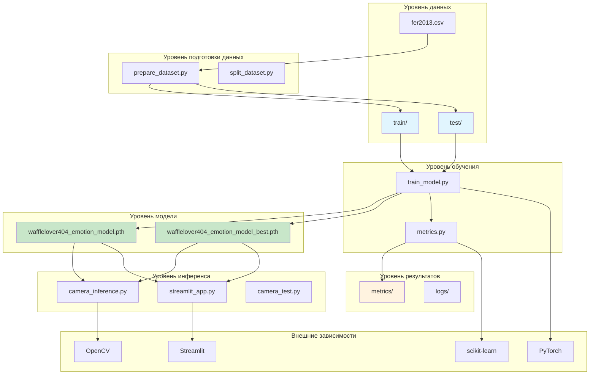

# Схема взаимодействия компонентов

## Архитектура системы



## Компоненты и их взаимодействие

### 1. Модули подготовки данных
- **prepare_dataset.py**: Конвертирует CSV в изображения
- **split_dataset.py**: Разделяет данные на train/test

### 2. Модуль обучения
- **train_model.py**: Основной скрипт обучения
- **metrics.py**: Утилиты для расчета метрик

### 3. Модули инференса
- **camera_inference.py**: Работа с камерой через OpenCV
- **streamlit_app.py**: Веб-интерфейс
- **camera_test.py**: Тестирование камеры

### 4. Потоки данных

#### Поток обучения:
```
CSV → prepare_dataset.py → train/test → train_model.py → model.pth → metrics/
```

#### Поток инференса:
```
model.pth → camera_inference.py/streamlit_app.py → камера/файл → результаты
```

## Зависимости

### Основные:
- **PyTorch**: Нейросеть и обучение
- **OpenCV**: Работа с изображениями и камерой
- **Streamlit**: Веб-интерфейс

### Вспомогательные:
- **scikit-learn**: Метрики и ROC-кривые
- **matplotlib/seaborn**: Визуализация
- **Pillow**: Обработка изображений
- **numpy**: Вычисления

## Запуск

### Быстрый запуск:
```bash
./start.sh
```

### Поэтапный запуск:
```bash
# 1. Подготовка данных
python prepare_dataset.py

# 2. Обучение
python train_model.py

# 3. Инференс
python camera_inference.py
# или
streamlit run streamlit_app.py
```

## Хранение результатов

- **Модели**: `*.pth` файлы
- **Метрики**: папка `metrics/`
- **Логи**: папка `logs/`
