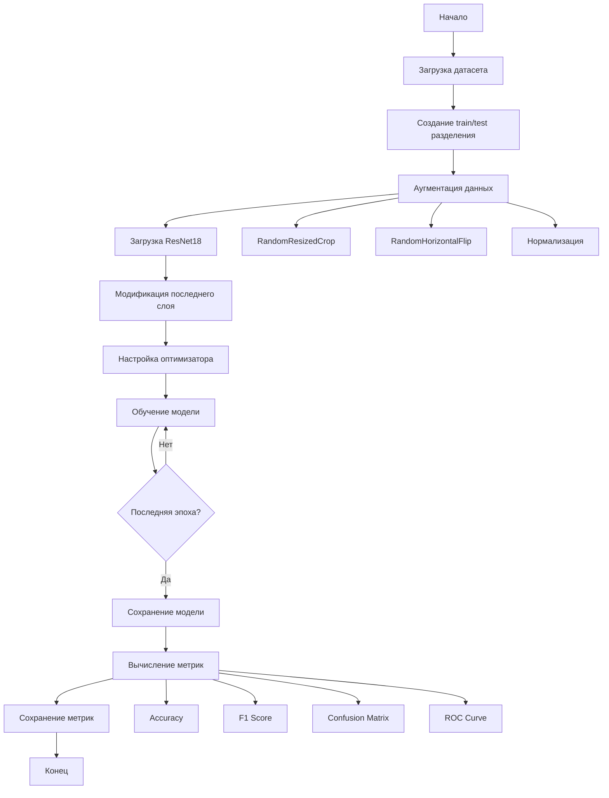
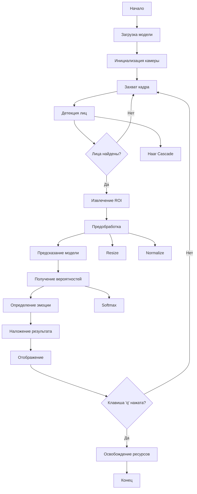
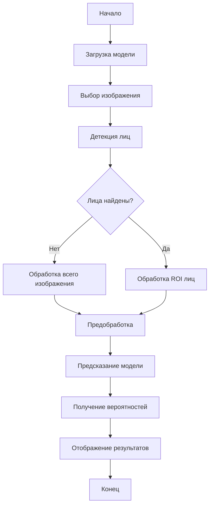

# Блок-схема алгоритма работы системы распознавания эмоций

## 1. Обучение модели

## 2. Инференс (Камера)

## 3. Инференс (Загрузка изображения)

## Описание этапов

### Обучение:
1. **Подготовка данных**: Разделение на train/test, аугментация
2. **Настройка модели**: ResNet18 с заменой последнего слоя
3. **Обучение**: Forward/backward pass, оптимизация
4. **Оценка**: Вычисление метрик качества

### Инференс:
1. **Детекция**: Поиск лиц на кадре
2. **Предобработка**: Изменение размера, нормализация
3. **Предсказание**: Прогон через нейросеть
4. **Визуализация**: Наложение результатов на изображение
