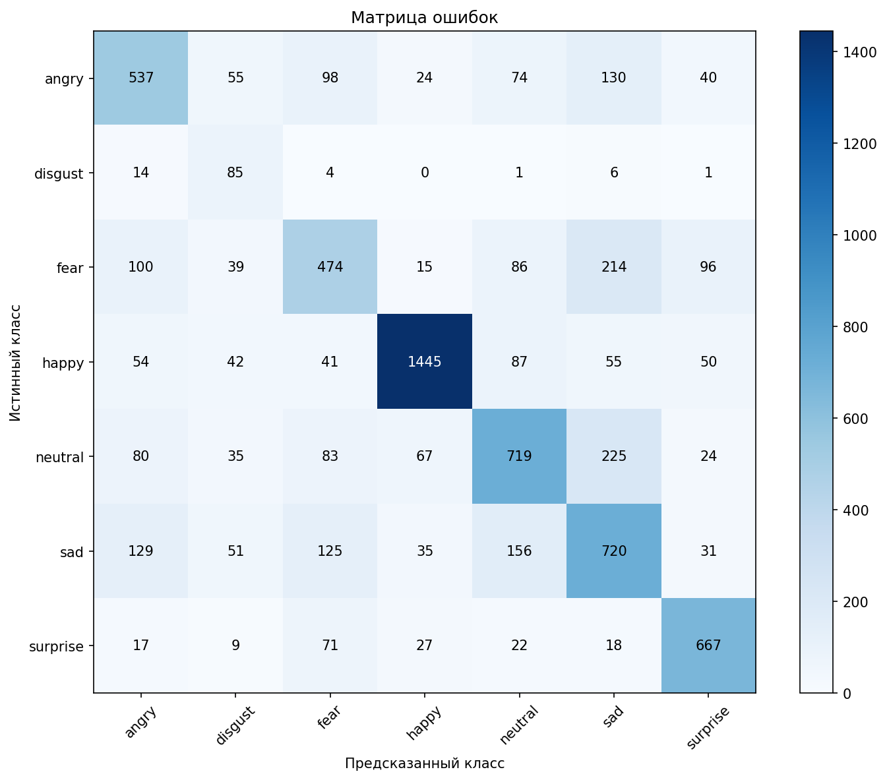
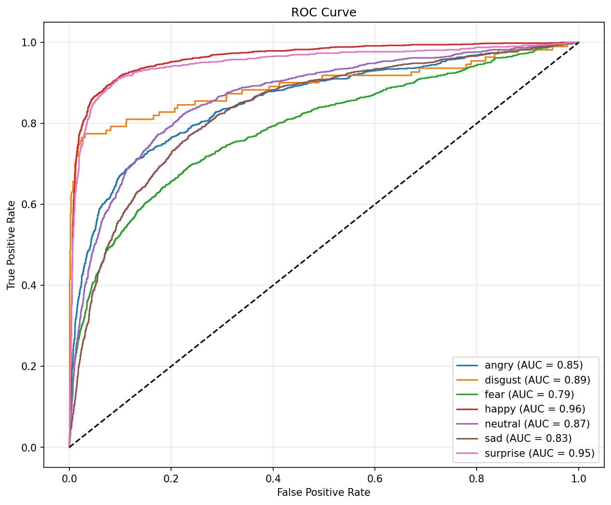

# 📊 Отчёт о тестировании модели

**Модель:** `wafflelover404_max.pth`  
**Дата:** 2026-02-14 15:14:45  
**Тестовый набор:** `test`  
**Изображений:** 7178

---

## 🎯 Основные метрики

| Метрика | Значение |
|---------|----------|
| Accuracy | **0.6474** |
| F1 Macro | **0.6051** |
| F1 Weighted | **0.6517** |
| Avg ROC AUC | **0.8799** |

---

## 📈 ROC AUC по классам

| Класс | ROC AUC |
|-------|---------|
| angry | 0.8502 |
| disgust | 0.9029 |
| fear | 0.7937 |
| happy | 0.9623 |
| neutral | 0.8685 |
| sad | 0.8305 |
| surprise | 0.9511 |

---

## 🎯 Матрица ошибок



---

## 📊 ROC Curve



---

## 📋 Classification Report

| Класс | Precision | Recall | F1-Score | Support |
|-------|-----------|--------|----------|---------|
| angry | 0.5768 | 0.5605 | 0.5686 | 958 |
| disgust | 0.2690 | 0.7658 | 0.3981 | 111 |
| fear | 0.5290 | 0.4629 | 0.4938 | 1024 |
| happy | 0.8958 | 0.8145 | 0.8533 | 1774 |
| neutral | 0.6279 | 0.5831 | 0.6047 | 1233 |
| sad | 0.5263 | 0.5774 | 0.5507 | 1247 |
| surprise | 0.7338 | 0.8026 | 0.7667 | 831 |

---

## 📊 Confusion Matrix (числа)

```
[[537, 55, 98, 24, 74, 130, 40], [14, 85, 4, 0, 1, 6, 1], [100, 39, 474, 15, 86, 214, 96], [54, 42, 41, 1445, 87, 55, 50], [80, 35, 83, 67, 719, 225, 24], [129, 51, 125, 35, 156, 720, 31], [17, 9, 71, 27, 22, 18, 667]]
```

---

*Отчёт сгенерирован автоматически*
